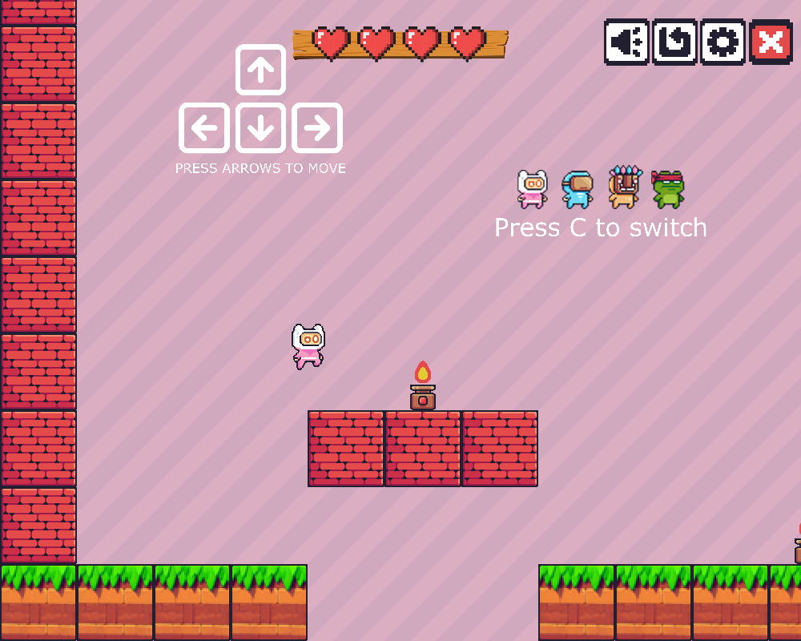

# Hizem's Game — Pixel Platformer

A 2D side-scrolling platformer made with **Python** and **Pygame**. Run and double-jump across the level, avoid the fire traps, and switch between four playable characters.



> **Status: work in progress.** The first level, the core movement and the HUD are playable; the quit button and more levels are not implemented yet.

## Features

- **Pixel-perfect collisions** using sprite masks, with separate horizontal and vertical collision handling
- **Double jump** and gravity with falling acceleration
- **Animated characters** (idle, run, jump, double jump, fall, hit) loaded from sprite sheets and flipped for both directions
- **Four characters** to switch between at any time
- **Fire traps** that animate and take away a life on contact, with a short invincibility cooldown after each hit
- **Lives HUD** (4 hearts) and a game over screen
- **Camera scrolling** that follows the player near the screen edges
- **Toolbar buttons**: music on/off, restart, and a settings panel that pauses the game with a fade-in
- On-screen control hints in the level

## Controls

| Key | Action |
|---|---|
| `←` `→` | Move |
| `Space` / `↑` | Jump (press again in the air to double jump) |
| `C` | Switch character |
| `R` | Restart |
| `E` | Quit |

The toolbar at the top right is clickable: music, restart and settings.

## Getting started

Requires **Python 3.8+**.

```bash
pip install -r requirements.txt
python main.py
```

To add background music, put an `.mp3` file in a `music/` folder next to `main.py`.

## Project structure

```
├── main.py      # Game loop, player physics, collisions, traps, HUD and menus
├── assets/      # Sprite sheets, terrain, backgrounds, buttons and HUD images
└── docs/        # README screenshot
```

## Credits

- Character, terrain, trap and menu sprites from the free [Pixel Adventure](https://pixelfrog-assets.itch.io/pixel-adventure-1) asset pack by **Pixel Frog**.
- The sprite sheet loading and collision approach started from [Tech With Tim](https://www.youtube.com/@TechWithTim)'s Pygame platformer tutorial, then extended with lives, traps, menus, music and character switching.

## License

Code: [MIT](LICENSE). The Pixel Adventure assets remain under Pixel Frog's license.
